<div align="center">

# heartstack — Multi-Cohort Coronary Artery Disease Risk Models

**heartstack is a leakage-safe modelling pipeline for coronary artery disease risk from routine clinical measurements. It takes three public cohorts through these steps to a model card with external validation:**

`validate each source` → `harmonise and de-duplicate` → `split once` → `select with nested CV` → `test once` → `leave one source out` → `write the model card`.


**[Summary](#1-summary)** ·
**[Workflow](#4-the-end-to-end-workflow)** ·
**[Run it](#10-how-to-run-heartstack)** ·
**[Configuration](#104-environment-variables)** ·
**[Known problems](#13-known-problems)** ·
**[Glossary](#15-glossary)**

</div>

> [!NOTE]
> This README uses ASD-STE100 Simplified Technical English. The writing rules and the project
> vocabulary are in [`docs/ste-style-guide.md`](docs/ste-style-guide.md). Each term in the
> [Glossary](#15-glossary) has only one meaning.

> [!WARNING]
> Do not use heartstack to make decisions about a patient. It is a research pipeline, not a diagnostic device.
> A clinician must review every use. The public cohorts do not represent all populations.

---

heartstack predicts the presence of coronary artery disease from 11 routine measurements. It pools three public
cohorts, but it keeps the source of each row. The main idea is honest validation: all preprocessing is fit inside
the folds, the model is selected without the test set, and each source is used one time as an external test set.

This README is the **one location that explains all of heartstack**. It gives these topics:

- the general design
- each component and its procedure, step by step
- the decision rules
- the data map
- the runbook
- the validation results and the known problems

| If you are… | Read |
|---|---|
| A manager or reviewer | [1](#1-summary), [3](#3-design-rules), [4](#4-the-end-to-end-workflow), [12](#12-validation-results), [14](#14-key-points) |
| A developer who joins the project | All sections, in sequence. Keep [10](#10-how-to-run-heartstack) and [13](#13-known-problems) open while you work |
| An operator who runs heartstack | [10](#10-how-to-run-heartstack), then the section for the component that you use |

---

## Table of contents

1. 🧭 [Summary](#1-summary)
2. 🏗️ [How heartstack is built](#2-how-heartstack-is-built)
   - 2.1 [Components](#21-components)
   - 2.2 [System context](#22-system-context)
   - 2.3 [Repository layout](#23-repository-layout)
3. 🛡️ [Design rules](#3-design-rules)
4. 🔄 [The end-to-end workflow](#4-the-end-to-end-workflow)
   - 4.1 [Full flow](#41-full-flow)
   - 4.2 [The life cycle of one run](#42-the-life-cycle-of-one-run)
   - 4.3 [Who does which step](#43-who-does-which-step)
5. 🔵 [Source validation and harmonisation](#5-source-validation-and-harmonisation)
6. 🟢 [The pipelines and the model zoo](#6-the-pipelines-and-the-model-zoo)
7. 🟣 [Model selection and evaluation](#7-model-selection-and-evaluation)
8. ⚖️ [The metrics and the decision rules](#8-the-metrics-and-the-decision-rules)
9. 🗂️ [Data and file map](#9-data-and-file-map)
10. ▶️ [How to run heartstack](#10-how-to-run-heartstack)
    - 10.1 [Prerequisites](#101-prerequisites) · 10.2 [Installation](#102-installation) · 10.3 [Run heartstack](#103-run-heartstack) · 10.4 [Environment variables](#104-environment-variables)
11. 🧩 [How to extend heartstack](#11-how-to-extend-heartstack)
12. ✅ [Validation results](#12-validation-results)
13. ⚠️ [Known problems](#13-known-problems)
14. 📌 [Key points](#14-key-points)
15. 📖 [Glossary](#15-glossary)
16. 📄 [License](#16-license)

---

## 1. Summary

**The problem.** Pooled heart disease data sets give high scores in a random split, but the score can come from source artefacts and from leakage. These are the difficult questions:

- How do you combine three sources with different codes and different missing-value conventions?
- How do you make sure that no step sees the test set?
- How well does a model transfer to a cohort that it did not see?
- Is the risk score calibrated, and which operating point does it give?

heartstack gives each of these questions its own component.

| Item | Value |
|---|---|
| Input | Three public CSV files (or synthetic files in the same layouts) |
| Output | `harmonised.csv`, `report.json`, `model_card.md`, `model.pkl` |
| Components | **5**: source validation, harmonisation, pipelines, experiment, model card |
| Models | `logreg` (baseline), `random_forest`, `hist_gbm`, `stack`, optional `xgboost` |
| Offline mode | Everything. No network is necessary after the download of the public files |
| Safety | No leakage by design. The test set is scored one time. The model card states the limits |
| Tests | **25** unit tests pass and **1** skips in CI (the optional XGBoost test) |

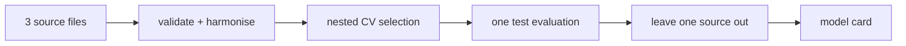

---

## 2. How heartstack is built

### 2.1 Components

| Component | Module | Purpose |
|---|---|---|
| Configuration | `src/heartstack/config.py` | Read and check all `HEARTSTACK_*` environment variables |
| Source validation | `src/heartstack/sources.py` | Code books, zero-as-missing, range checks, harmonised table, de-duplication, profile |
| Pipelines | `src/heartstack/models.py` | Preprocessing and the model zoo as sklearn `Pipeline` objects, parameter grids |
| Metrics | `src/heartstack/metrics.py` | AUROC, AUPRC, Brier, operating point, calibration, decision curve, bootstrap intervals |
| Experiment | `src/heartstack/experiment.py` | Split, nested CV, final fit, threshold, test evaluation, subgroups, LOSO, permutation importance |
| Model card | `src/heartstack/report.py` | `model_card.md` and `report.json` |
| Synthetic data | `src/heartstack/synthetic.py` | Invented rows in the three source layouts, with the same problems |
| CLI | `src/heartstack/cli.py` | The `heartstack` command |

The component map shows which module calls which module. An arrow points from the caller to the module that it uses.

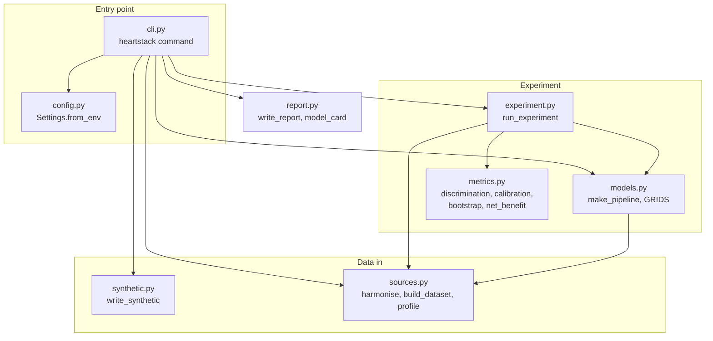

### 2.2 System context

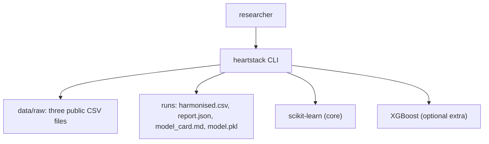

### 2.3 Repository layout

```
heartstack/
├── .github/workflows/ci.yml   # CI: install ".[dev]" and run pytest on Python 3.11
├── data/README.md             # sources, licences, columns, known properties of the files
├── docs/ste-style-guide.md    # writing rules and project vocabulary
├── src/heartstack/            # the package (one module for each component, see 2.1)
├── tests/                     # pytest suite: 26 tests, synthetic data only
├── .env.example               # variable names only
├── pyproject.toml             # core dependencies, extras and the console script
└── LICENSE                    # MIT
```

---

## 3. Design rules

### 3.1 No step sees the test set
Imputation, scaling, encoding and the model are one sklearn `Pipeline`. The pipeline is fit inside each fold. The split happens before any fit, and the test set is scored one time, after the selection.

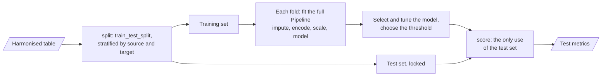

### 3.2 Selection with nested CV
The inner search tunes each model on AUROC. The outer folds score the tuned model. heartstack selects the model with the best mean outer AUROC. The test set has no part in this choice.

### 3.3 Zero is not a measurement
A value of 0 for cholesterol or resting blood pressure becomes missing. The pipeline imputes the median and adds a missing indicator. You can turn the indicators off with `HEARTSTACK_MISSING_INDICATORS=false`.

### 3.4 No silent row loss
A code that the code book does not know stops the build with an error. A code that the code book marks as "not recorded" (slope code 0) becomes missing, and the row stays. Each count goes into the build report.

### 3.5 The source is kept and tested
Each row keeps its `source`. The split is stratified by source and target. Leave-one-source-out gives an external test for each source. The `source` is not a feature unless you set `HEARTSTACK_INCLUDE_SOURCE=true`.

### 3.6 Nominal codes are one-hot encoded
Chest pain type, resting ECG and ST slope get one column for each level and one for "missing". No model sees an alphabetical integer code.

### 3.7 Clinical metrics and fixed seeds
The report gives AUROC, AUPRC, Brier, sensitivity and specificity at a threshold from training predictions, calibration, a decision curve and bootstrap intervals. All random steps of the experiment use `HEARTSTACK_SEED`. The synthetic files use `synth --seed` (default 7).

---

## 4. The end-to-end workflow

### 4.1 Full flow

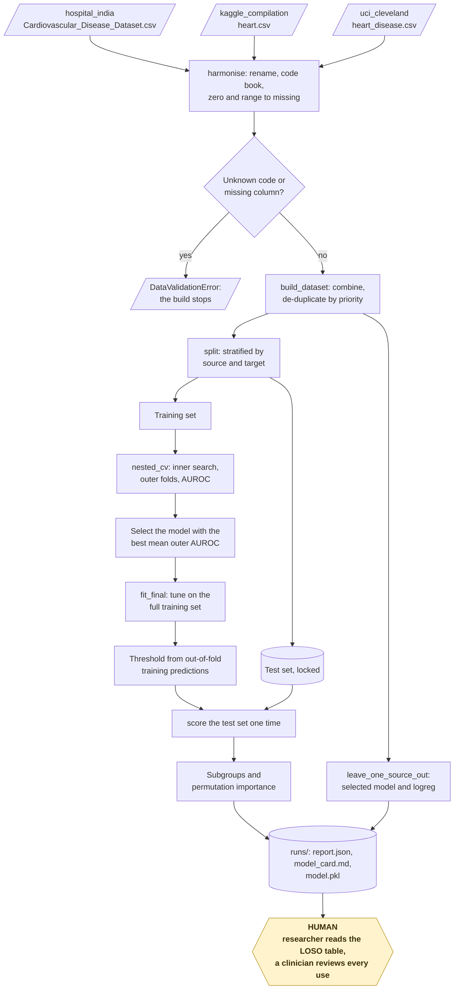

### 4.2 The life cycle of one run

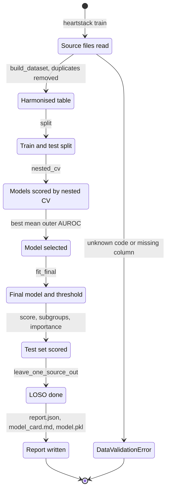

1. `heartstack train` reads the three files and validates each with its code book.
2. The harmonised rows go into one table. Rows that are in two sources are removed one time.
3. The split keeps 20% of the rows as the test set. It does not touch them again until step 7.
4. Nested CV scores each model on the training set.
5. The best model is tuned again on the full training set.
6. Out-of-fold predictions on the training set give the threshold for a sensitivity of 0.90.
7. The test set is scored one time. The bootstrap gives the 95% intervals.
8. Leave-one-source-out trains on two sources and tests on the third, for the selected model and for `logreg`.
9. The CLI writes `report.json`, `model_card.md` and `model.pkl`.

### 4.3 Who does which step

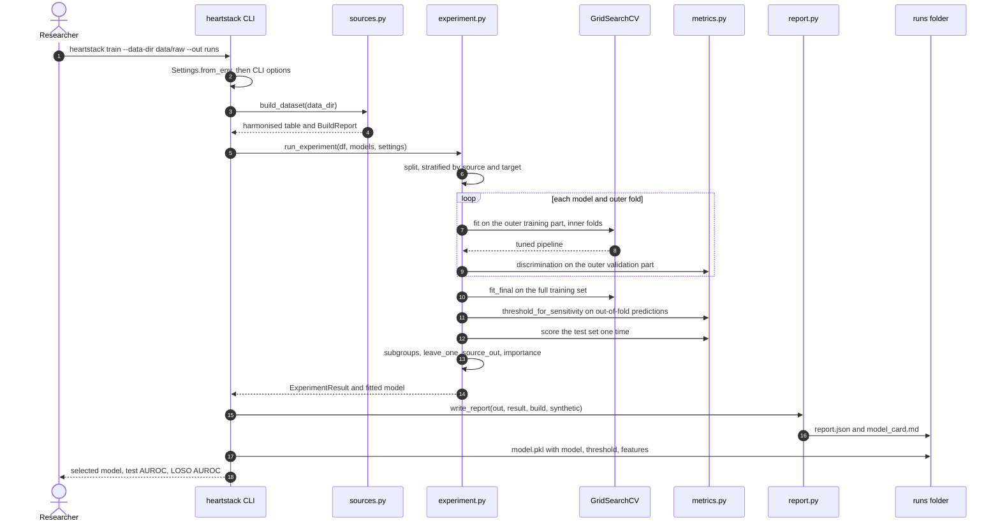

---

## 5. Source validation and harmonisation

**Purpose.** Make one harmonised table from three sources with different column names, codes and missing-value conventions, and report every change.

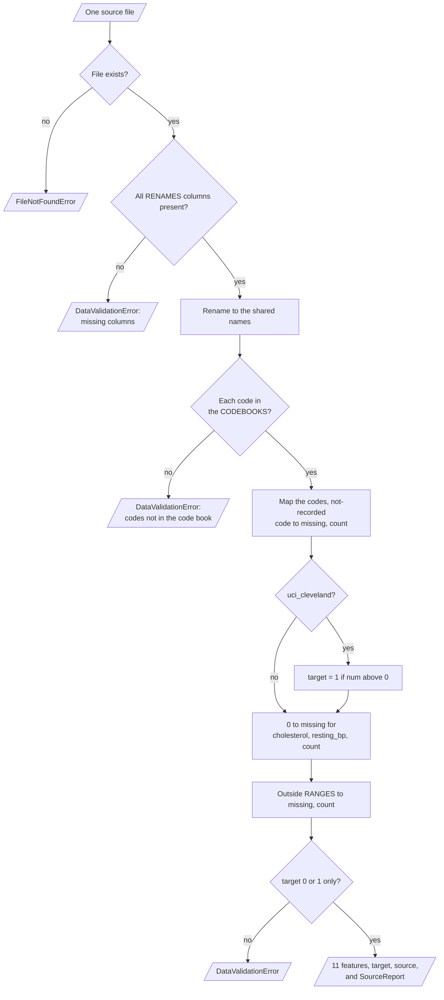

| Input | Output |
|---|---|
| `Cardiovascular_Disease_Dataset.csv`, `heart.csv`, `heart_disease.csv` | Harmonised table: 11 features, `target`, `source`. A build report with counts for each source |

**Procedure**

1. Check that each file has its expected columns.
2. Rename the columns to the shared names.
3. Map the codes with the code book of the source. Stop if a code is not in the code book.
4. Change 0 to missing for `cholesterol` and `resting_bp`. Count the changes.
5. Change values outside the plausible range to missing. Count the changes.
6. Make the Cleveland target binary: `num > 0` is 1.
7. Combine the sources. Remove duplicates and keep the copy from the source with the higher priority.

**Rules**

- The de-duplication priority is `uci_cleveland`, then `hospital_india`, then `kaggle_compilation`. So the 303 Cleveland rows stay with their own source.
- `patientid`, `noofmajorvessels`, `ca` and `thal` are not used, because the other sources do not have them.

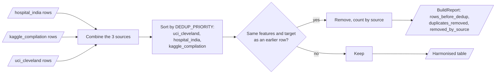

| Feature | Type | Plausible range or levels |
|---|---|---|
| `age` | numeric | 18 to 100 years |
| `resting_bp` | numeric | 60 to 250 mmHg (0 = missing) |
| `cholesterol` | numeric | 80 to 700 mg/dL (0 = missing) |
| `max_hr` | numeric | 50 to 230 beats/min |
| `oldpeak` | numeric | −5 to 10 mm |
| `sex_male`, `fasting_bs`, `exercise_angina` | binary | 0 or 1 |
| `chest_pain` | nominal | `typical_angina`, `atypical_angina`, `non_anginal`, `asymptomatic` |
| `resting_ecg` | nominal | `normal`, `st_t_abnormality`, `lv_hypertrophy` |
| `st_slope` | nominal | `up`, `flat`, `down` (hospital code 0 = missing) |

---

## 6. The pipelines and the model zoo

**Purpose.** Give each model the same leakage-safe preprocessing as one fitted object.

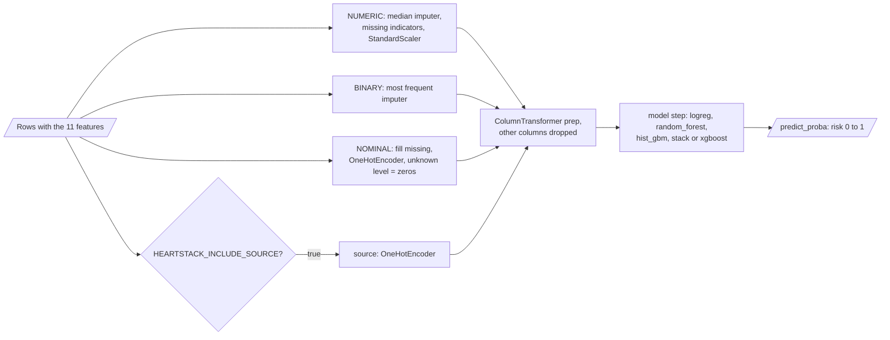

| Input | Output |
|---|---|
| The 11 features (and `source` if enabled) | A predicted risk from 0 to 1 |

**Procedure**

1. Numeric columns: impute the median, add missing indicators, scale.
2. Binary columns: impute the most frequent value.
3. Nominal columns: fill "missing", then one-hot encode. Unknown levels at prediction time get zeros.
4. Fit the model on the transformed training rows.

| Model | Definition | Grid for the inner search |
|---|---|---|
| `logreg` | Logistic regression, `max_iter=2000` | `C` in 0.1, 1, 10 |
| `random_forest` | 300 trees, `min_samples_leaf=3` | `max_depth` in None, 6. `min_samples_leaf` in 1, 5 |
| `hist_gbm` | Histogram gradient boosting, 200 iterations | `max_depth` in 3, None. `learning_rate` in 0.05, 0.1 |
| `stack` | `logreg` + `random_forest` + `hist_gbm`, logistic regression on their 5-fold out-of-fold probabilities | `C` of the final model in 0.1, 1 |
| `xgboost` | Optional (`pip install -e ".[boost]"`) | `max_depth` in 2, 4 |

**Rules**

- No model uses class weights. The classes are close to balanced, and class weights make the risks less calibrated.
- The stack trains its final model on out-of-fold probabilities, so the base models do not leak into it.

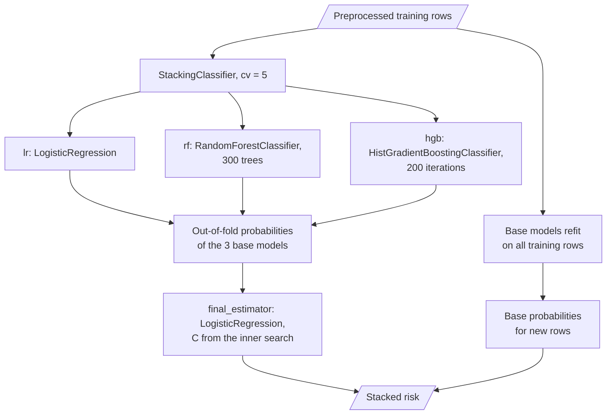

---

## 7. Model selection and evaluation

**Purpose.** Select a model without the test set, then measure it on the test set and on each unseen source.

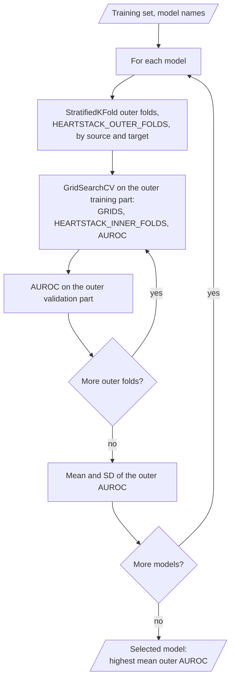

`fit_final` tunes the selected model on the full training set and finds the threshold. Leave-one-source-out uses the same function on two sources.

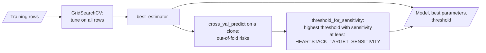

| Input | Output |
|---|---|
| The harmonised table and the model names | `ExperimentResult`: selection table, selected model, parameters, threshold, test metrics, subgroups, LOSO, importance |

**Procedure**

1. Split the table: `HEARTSTACK_TEST_SIZE` (default 0.2), stratified by source and target.
2. For each model, run `HEARTSTACK_OUTER_FOLDS` outer folds. In each, run an inner search with `HEARTSTACK_INNER_FOLDS` folds.
3. Select the model with the best mean outer AUROC.
4. Tune the selected model on the full training set.
5. Get out-of-fold training predictions. Find the highest threshold with a sensitivity of at least `HEARTSTACK_TARGET_SENSITIVITY`.
6. Score the test set: discrimination, operating point, calibration, decision curve, bootstrap intervals.
7. Score subgroups of the test set: sex, age below or above 55, source. A subgroup needs at least 20 rows and both classes.
8. Run leave-one-source-out for the selected model and for `logreg`. Each run tunes and finds its threshold on the two training sources only.
9. Calculate permutation importance on the test set (AUROC drop, 10 repeats).

**Rules**

- The test set gives one full evaluation. The subgroup scores and the importance use the same predictions after the selection. They do not change the selection.
- `--fast` sets 3 outer folds, 200 bootstrap samples and all CPU cores.

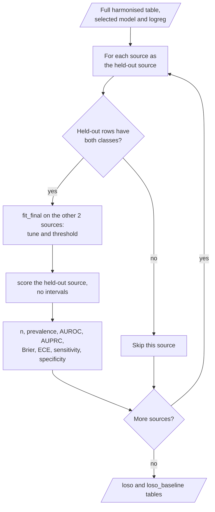

---

## 8. The metrics and the decision rules

| Metric | Definition |
|---|---|
| AUROC | Area under the ROC curve |
| AUPRC | Average precision |
| Brier | Mean squared error of the risk |
| Threshold | The highest risk value with an out-of-fold training sensitivity of at least 0.90 (default) |
| Sensitivity, specificity, PPV, NPV | At the threshold |
| ECE | Expected calibration error over 10 equal-width bins |
| Calibration slope and intercept | Logistic fit of the outcome on the logit of the risk. Slope 1 and intercept 0 are ideal |
| Decision curve | Net benefit = TP/n − FP/n × t/(1 − t), at t = 0.05 to 0.50, with "treat all" and "treat none" |
| 95% interval | Percentile bootstrap, resampled inside each class, `HEARTSTACK_BOOTSTRAP` samples (default 1,000) |

The `score` function applies these metrics to one set of rows.

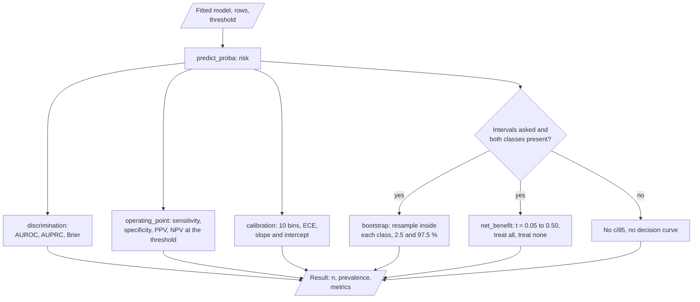

On the test set, the same model and threshold also give the subgroup scores and the permutation importance.

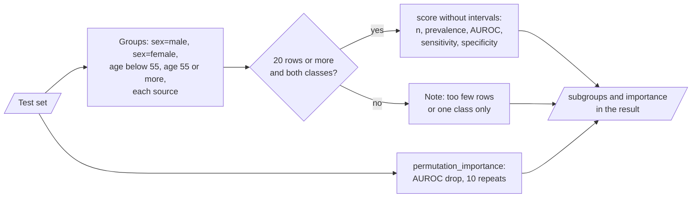

| Decision | Rule |
|---|---|
| Model selection | Highest mean outer-fold AUROC in nested CV |
| Threshold | From out-of-fold training predictions only |
| Duplicate across sources | Keep the copy from the source with the higher priority |
| Unknown code | Stop the build |
| Zero cholesterol or blood pressure | Missing |

---

## 9. Data and file map

| Path | Committed? | Contents |
|---|---|---|
| `data/README.md` | Yes | Sources, licences, columns and known properties |
| `data/raw/` | No (git ignores it) | The three public CSV files |
| `data/synthetic/` | No (git ignores it) | Output of `heartstack synth` |
| `runs/harmonised.csv` | No (git ignores it) | Output of `heartstack build-data` |
| `runs/report.json` | No (git ignores it) | All results of `heartstack train` |
| `runs/model_card.md` | No (git ignores it) | The model card |
| `runs/model.pkl` | No (git ignores it) | The fitted pipeline, the threshold and the feature list |
| `runs/demo/` | No (git ignores it) | Output of `heartstack demo` |

The diagram shows which command writes each output file. The model card comes from `report.py`.

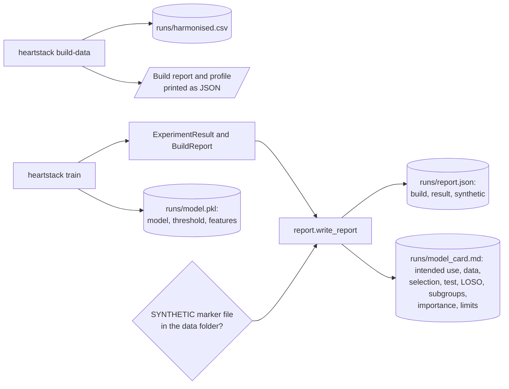

---

## 10. How to run heartstack

### 10.1 Prerequisites

| Need | For |
|---|---|
| Python 3.11+ | All components |
| The three public CSV files | Real results (see `data/README.md`) |
| XGBoost | Optional `xgboost` model |

### 10.2 Installation

```bash
git clone https://github.com/KrishnaAnnavaram/heartstack.git
cd heartstack
python -m venv .venv
. .venv/bin/activate            # Windows: .venv\Scripts\activate
pip install -e ".[dev]"         # extras: boost, explain, all
```

### 10.3 Run heartstack

```bash
# 1. Offline demo on synthetic files (about 2 minutes on 22 cores)
heartstack demo --out runs/demo

# 2. The public files in data/raw/
heartstack build-data --data-dir data/raw --out runs
HEARTSTACK_N_JOBS=-1 heartstack train --data-dir data/raw --out runs
heartstack train --data-dir data/raw --out runs/lr --models logreg --fast

# 3. Risk for new rows with the harmonised columns
heartstack predict --model runs/model.pkl --input new_rows.csv --output risks.csv
```

`heartstack synth --out-dir data/synthetic` writes the synthetic files only. Load `model.pkl` only if you made it yourself, because a pickle file can run code.

The diagram shows the order of the commands and the files that connect them.

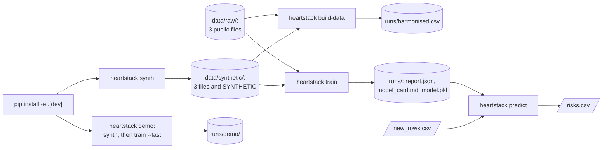

The synthetic files (`synthetic.write_synthetic`) copy the layouts and the known problems of the three public files.

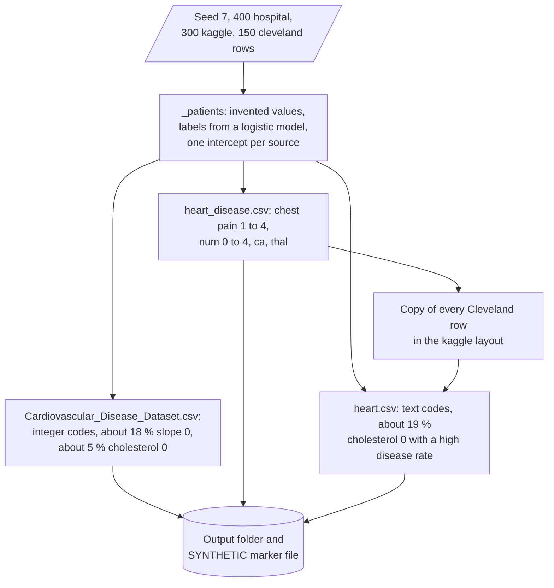

`heartstack predict` scores new rows with a saved model.

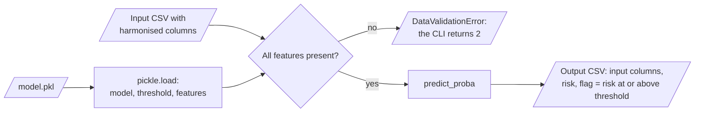

### 10.4 Environment variables

| Variable | Used by | Meaning |
|---|---|---|
| `HEARTSTACK_DATA_DIR` | Source validation | Folder with the three files. Default `data/raw` |
| `HEARTSTACK_WORK_DIR` | CLI | Output folder. Default `runs` |
| `HEARTSTACK_SEED` | Experiment | Seed of all random steps. Default 42 |
| `HEARTSTACK_TEST_SIZE` | Experiment | Share of the test set, 0.05 to 0.5. Default 0.2 |
| `HEARTSTACK_OUTER_FOLDS` | Experiment | Outer folds of nested CV. Default 5 |
| `HEARTSTACK_INNER_FOLDS` | Experiment | Inner folds and out-of-fold folds. Default 3 |
| `HEARTSTACK_N_JOBS` | Experiment | Parallel jobs of the inner search. Default 1. −1 uses all cores |
| `HEARTSTACK_TARGET_SENSITIVITY` | Threshold | Default 0.90 |
| `HEARTSTACK_BOOTSTRAP` | Intervals | Bootstrap samples. Default 1,000 |
| `HEARTSTACK_INCLUDE_SOURCE` | Pipelines | `false` (default) or `true` |
| `HEARTSTACK_MISSING_INDICATORS` | Pipelines | `true` (default) or `false` |

heartstack uses no credentials.

```mermaid
flowchart LR
    PENV[/"Process environment"/] --> FE["Settings.from_env"]
    FE --> CHK{"Numbers in range and<br/>flags true or false?"}
    CHK -- "no" --> ERR[/"ConfigError: the CLI prints<br/>error: and returns 2"/]
    CHK -- "yes" --> SET["Settings"]
    SET --> OPT["CLI options replace values:<br/>--data-dir, --out, --seed"]
    OPT --> FAST{"--fast?"}
    FAST -- "yes" --> F3["3 outer folds, 3 inner folds,<br/>200 bootstrap samples, all cores"]
    FAST -- "no" --> USE[/"Settings for the command"/]
    F3 --> USE
```

---

## 11. How to extend heartstack

| You want to… | Do this | Code change? |
|---|---|---|
| Add a source | Add its file name, renames and code book to `sources.py` and a test | Small |
| Add a model | Add a factory to `MODELS` and a grid to `GRIDS` in `models.py` | Small |
| Use XGBoost | `pip install -e ".[boost]"` and `--models logreg,xgboost` | No |
| Change the operating point | Set `HEARTSTACK_TARGET_SENSITIVITY` | No |
| Test without missing indicators | Set `HEARTSTACK_MISSING_INDICATORS=false` | No |
| Add SHAP values | Install the `explain` extra and call SHAP on the fitted pipeline | Small |

---

## 12. Validation results

| Validation | Result | Command |
|---|---|---|
| Unit tests | **25 passed, 1 skipped** (XGBoost is not installed in CI) | `pytest -q` |
| Build on the public files | 2,221 rows read, 303 duplicates removed, 1,918 rows. 53 + 172 zero cholesterol and 1 zero blood pressure now missing. 180 slope code 0 rows kept | `heartstack build-data` |

**Public files, measured locally, not reproduced in CI.** `heartstack train` with the defaults (seed 42, 5 outer folds, 1,000 bootstrap samples):

| Step | Result |
|---|---|
| Nested CV AUROC (mean ± SD) | `logreg` 0.955 ± 0.008, `random_forest` 0.957 ± 0.007, `hist_gbm` 0.963 ± 0.003, `stack` 0.961 ± 0.003 |
| Selected model | `hist_gbm` (`max_depth=3`, `learning_rate=0.05`), threshold 0.617 |
| Test set (n = 384) | AUROC 0.972 [0.952, 0.987], sensitivity 0.927 [0.890, 0.959], specificity 0.928 [0.886, 0.964], ECE 0.044 |
| Leave out `hospital_india` (n = 1,000) | AUROC 0.663 (`logreg` baseline 0.776) |
| Leave out `kaggle_compilation` (n = 615) | AUROC 0.917 (`logreg` baseline 0.919) |
| Leave out `uci_cleveland` (n = 303) | AUROC 0.778 (`logreg` baseline 0.780) |

**Synthetic demo.** `heartstack demo` selects `logreg` (nested CV AUROC 0.798). The test AUROC is 0.859, and LOSO AUROC is 0.775, 0.783 and 0.842. These numbers only show that the pipeline runs.

The pooled test AUROC is high, but it does not transfer. When the hospital cohort is not in the training data, AUROC falls to 0.663, and the simple baseline is better. Inside the hospital cohort, the test AUROC is 0.997, and `st_slope` has the largest permutation importance. This pattern suggests a cohort-specific signal, not a general one. The prototype reported an accuracy of 0.92 for its best stack. That is a prototype result, not reproduced here, and it came from a pipeline with leakage.

---

## 13. Known problems

Read these problems before you use heartstack results.

| # | Area | Problem | Impact and action |
|---|---|---|---|
| 1 | Transfer | Models trained on two sources score much lower on the third (AUROC 0.663 for the hospital cohort) | Do not report the pooled test AUROC alone. Report the LOSO table |
| 2 | Missing indicators | Missing cholesterol is frequent in one source, so the indicator can carry source information | Compare a run with `HEARTSTACK_MISSING_INDICATORS=false` |
| 3 | Data | CI uses synthetic files. The real-data numbers above come from one local run | Run `heartstack train` on the public files to reproduce them |
| 4 | Populations | The cohorts are retrospective and come from a small number of hospitals and countries. Women are a minority | Subgroup results for women have wide uncertainty |
| 5 | Features | `ca`, `thal` and the number of major vessels are not used, because not all sources have them | Some strong predictors are missing |
| 6 | Calibration | Calibration is not corrected after the fit | Check the calibration slope before you use the risks as probabilities |
| 7 | Model file | `model.pkl` is a Python pickle | Load only model files that you made yourself |

---

## 14. Key points

1. **The test set is used one time.** Nested CV selects the model, and all preprocessing is fit inside the folds.
2. **Zero is missing.** Zero cholesterol and blood pressure become missing, and unknown codes stop the build.
3. **No silent row loss.** The 180 hospital rows with slope code 0 stay in the data.
4. **Transfer is measured.** Leave-one-source-out shows a large drop that a pooled split hides.
5. **The model card gives the limits.** It lists the data, the selection, the test results, the LOSO table, the subgroups and the limits.

---

## 15. Glossary

| Term | Meaning |
|---|---|
| **Source** | One of the three public data sets |
| **Code book** | The mapping from the codes of a source to the shared labels |
| **Harmonised table** | The table with the shared columns, the target and the source |
| **Feature** | One of the 11 shared input columns |
| **Target** | 1 for coronary artery disease, 0 for no disease |
| **Not-recorded code** | A code that the code book maps to missing |
| **Unknown code** | A code that is not in the code book |
| **Duplicate** | A row with the same features and target as a row from another source |
| **Pipeline** | Preprocessing and one model, fit as one unit |
| **Missing indicator** | A 0/1 column that shows a missing numeric value |
| **Baseline** | The `logreg` model |
| **Stack** | Three base models and a logistic regression on their out-of-fold probabilities |
| **Test set** | The held-out rows, scored one time |
| **Outer fold** | One fold of nested CV that scores a tuned model |
| **Inner search** | The grid search inside one outer fold |
| **Threshold** | The risk value above which a row is positive |
| **Operating point** | Sensitivity, specificity, PPV and NPV at the threshold |
| **Calibration** | How well the predicted risk matches the observed rate |
| **Decision curve** | Net benefit at each threshold |
| **Leave-one-source-out (LOSO)** | Train on two sources, test on the third |
| **Subgroup** | A part of the test set by sex, age or source |
| **Model card** | The file with the use, the data, the results and the limits |

---

## 16. License

[MIT](LICENSE) © 2026 Krishna Annavaram
